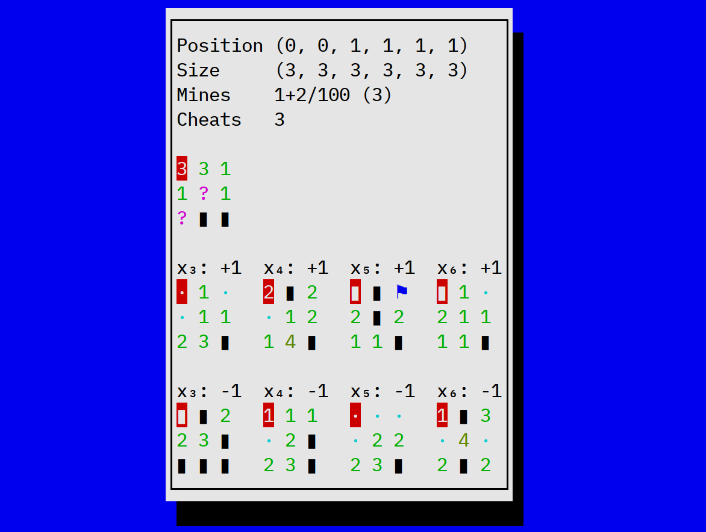

# mines6d
Minesweeper in 6 dimensions.



## Building
Install ``cargo``, then run
```
git clone https://github.com/dokutan/mines6d
cd mines6d
cargo build --release
```

## Installing
Build, then copy the binary to a directory in your ``$PATH``, e.g.
```
cp target/release/mines6d ~/.local/bin
```

## How to play
Install, then run
```
mines6d
```
You can press ``F1`` to show the manual.

## License
GNU GPLv3 or later
